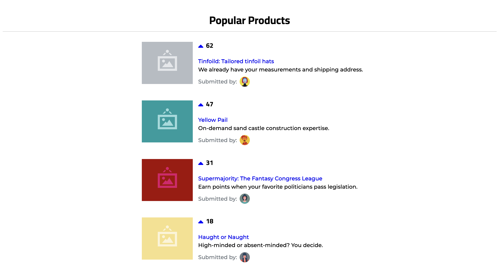

# Dynamic Products Page

This repository contains a solution for the Dynamic Product Page challenge. The goal of the challenge is to create a dynamic product page that lists various products and allows users to vote for their favorite products.

<div style="display: flex; align-items: center;">
  
  
</div>


## Setup

``` shell
$ cd jun.ukemori
$ npm install
$ npm start
```
The application will be accessible at http://localhost:3000.


## Technology Choices
- React: I chose React as the UI framework because of its component-based architecture and ease of use. React provides a straightforward way to manage the state of the application and efficiently render the UI based on data changes.

- CSS: For styling, I used CSS without any specific CSS library. Although the requirement doesn't focus on the visual appearance of the page, I ensured that the layout and styling were visually clear and organized.

The project utilizes the Facebook Create React App setup to provide a quick and efficient development environment. It uses React as the UI framework and follows modern JavaScript practices.


## Folder Structure
The project follows a typical React folder structure:
``` shell
- src/
  - components/  # folder contains corresponding css and test files
    - ProductCard
      - ProductCard.js
      - ProductCard.test.js
      - card.css
    - ProductList
      - ProductList.js
      - ProductList.test.js
      - list.css
  - data/
    - seed.js  # Contains utility functions provided to generate vote counts and return a list of products to render.
  - App.js  # The main component that represents the product page.
  - main.js  # The entry point of the application.
- index.html
- package.json

```
## Design Decisions
### User Interface

The user interface was designed to closely resemble the provided example. The product page layout consists of a list of products displayed in a vertical arrangement. Each product entry includes a title, description, votes count, submitter avatar, and product image.

The title of each product is a clickable link that redirects to the specified URL. Clicking the vote button increments the vote count for the corresponding product. If the voted product surpasses the product above it in terms of votes, it moves up in the product list to maintain the order.

The app includes the following key components:


### ProductCard
The Product component represents an individual product.  It retrieves the product data from the seed.js file and passes it to the Product component for rendering each individual product. It receives the product data as props and displays the product title, description, votes, submitter avatar, and product image. The product title is rendered as a link.

When the vote button is clicked, the Product component triggers a callback function provided by the ProductList component to update the vote count for that product.

### ProductList
It retrieves the product data from the ProductCard file and renders each individual product. 
The ProductList component is responsible for rendering the list of products.

The product list is sorted based on the vote count, with the products having the highest vote count appearing at the top. When a user clicks the vote button, the ProductList component updates the vote count for that product and triggers a re-render to reflect the updated order if necessary.


## Testing

### ProductCard
The tests ensure that the ProductCard component renders product details correctly and calls the handleVote function when the vote button is clicked.

### ProductList
The tests verify that the ProductList component renders product cards correctly, increments votes when the vote button is clicked, and displays a "No products found" message when there are no products.

To run the tests, use the following command:

``` shell
npm run test
```

## Time Spent

I spent approximately 6 hours completing this exercise.
